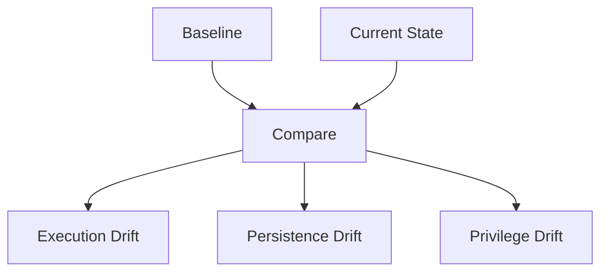

# ProcDrift

ProcDrift is a Linux host state drift analysis tool.

It records a baseline of execution, persistence, and privilege-relevant system state and later reports only what has changed. The output is intended to support threat hunting, incident response, and forensic triage by making unexpected or unauthorized changes visible.

ProcDrift does not attempt to classify intent or make decisions. It surfaces concrete differences in system state and provides enough context for an operator to investigate them.

---

## Operating Model

ProcDrift follows a simple model:

Baseline → Drift → Inspect

1. A baseline captures known-good system state.
2. A later run compares the current state to that baseline.
3. Only differences are reported, with supporting context.

Every finding is tied directly to observable system artifacts such as process identities, configuration files, persistence mechanisms, or permission changes. There are no abstract scores or inferred conclusions.

---

## How ProcDrift Works

The following diagram describes the high-level flow of ProcDrift:

---

## What ProcDrift Observes

### Execution

ProcDrift records a baseline of running process identities and later reports only newly observed identities.

For new processes, additional runtime context is collected to support investigation, including:
- parent process information
- working directory
- start time
- execution from unusual or temporary paths
- deleted executables
- environment variable usage relevant to runtime injection
- common interpreter staging patterns
- basic network socket ownership

The tool automatically excludes its own process and invocation chain.

---

### Persistence and Configuration

ProcDrift tracks changes to common persistence and configuration surfaces, including:
- system and user systemd units and enablement state
- scheduled task mechanisms
- shell initialization files
- SSH access and daemon configuration
- dynamic linker configuration

File-based changes are presented as unified diffs to make review straightforward.

---

### Privilege and System State

To highlight changes that affect trust boundaries, ProcDrift also tracks:
- user, group, and sudo configuration
- integrity drift of authentication databases (hash-only where appropriate)
- kernel modules and autoload configuration
- SUID and SGID executables
- metadata changes to security-relevant logs

---

## Output Characteristics

ProcDrift produces diff-only output.

When something is reported, the underlying artifact that caused the report is always visible:
- a process identity
- a file diff
- a permission change
- a kernel or privilege-related modification

This allows operators to validate findings directly against the system.

---

## Usage

Initialize or overwrite the baseline:

python3 procdrift.py init

Compare current state to the baseline:

python3 procdrift.py run

Running as root is recommended for complete visibility, but ProcDrift will operate with reduced coverage when run unprivileged.

---

## Scope and Intent

ProcDrift is designed to support human investigation.

It does not attempt to determine whether activity is benign or malicious, and it does not take action on the system. Its role is to make state changes explicit, traceable, and reviewable so that an operator can decide what matters.

---

## When ProcDrift Is Useful

- Establishing and validating a known-good host baseline
- Detecting unauthorized persistence
- Investigating suspicious execution paths
- Supporting incident response and post-compromise review
- Verifying system integrity over time
